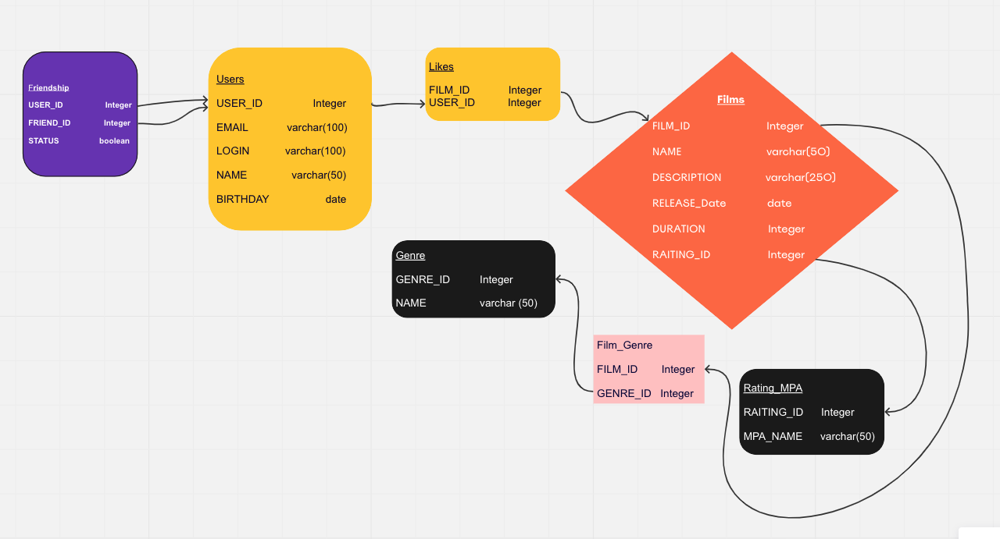

# Java-Filmorate 
приложение по оценки фильмов

Схема БД filmorate

<picture>
    <source media="(prefers-color-scheme: dark)" srcset="src/main/resources/schema.png">
    
</picture>

## Краткое поясение по диаграмме 
* `Таблица Friendship` - информация о статусе между двумя пользователе, находятся ли друг у друга в друзьях.
* 
* `Таблица Users` - модель пользователя.
* 
* `Таблица Likes` - информация и проставленных лайках фильмам.
* 
* `Таблица Films` - модель фильма.
* 
* `Таблица Rating_MPA` - возрастные ограниченя MPAA.
* 
* `Таблица Film_Genre` - информация о жанрах фильмов.
* 
* `Таблица Genre` - список жанров фильмов.
